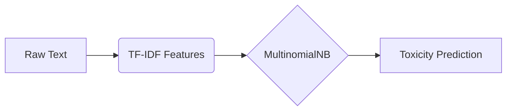

# 🚀 Toxic Terminator: AI-Powered Toxicity Detection 🛡️

[](https://opensource.org/licenses/MIT)
[](https://www.python.org/)
[](https://scikit-learn.org/)


> **"Purifying Digital Spaces One Tweet at a Time"** 🔍✨

---

## 📋 Table of Contents

1. [📌 Project Overview](#-project-overview)
2. [📊 Dataset Information](#-dataset-information)
3. [🧹 Data Preprocessing](#-data-preprocessing)
4. [⚙️ Feature Extraction](#️-feature-extraction)
5. [🤖 Model Training](#-model-training)
6. [📈 Model Evaluation](#-model-evaluation)
7. [💻 Installation](#-installation)
8. [🚦 Usage](#-usage)
9. [🚀 Future Enhancements](#-future-enhancements)
10. [🤝 Contributing](#-contributing)
11. [📜 License](#-license)
12. [🙏 Acknowledgements](#-acknowledgements)

---

## 📌 Project Overview

<div align="center">
  
</div>

Toxic Terminator is an **ML-powered shield** against online toxicity 🛡️. Our solution helps platforms:

✅ Automatically flag harmful content  
✅ Improve community moderation  
✅ Protect user mental health  
✅ Maintain positive digital environments  

---

## 📊 Dataset Information

### 🔗 Source
```diff
+ Kaggle Twitter Toxicity Dataset
- https://www.kaggle.com/datasets/ashwiniyer176/toxic-tweets-dataset
```

### 📦 Dataset Structure
| Column       | Type   | Description                | Example                      |
|--------------|--------|----------------------------|------------------------------|
| `Unnamed: 0` | int64  | Index column (removed)     | 0                            |
| `Toxicity`   | int64  | Binary label (0/1)         | 1 (Toxic)                    |
| `tweet`      | object | Tweet text content         | "@user This is offensive..." |

### 📊 Class Distribution
```python
print(df['Toxicity'].value_counts(normalize=True))
```
```
0    57.4% 🟢 (Non-Toxic)
1    42.6% 🔴 (Toxic)
```

---

## 🧹 Data Preprocessing

### 🔄 Cleaning Pipeline
1. 🗑️ Remove index column
2. 🧼 Handle missing values
3. ✂️ Text normalization:
   - Remove @mentions
   - Strip URLs
   - Eliminate special characters
   - Convert to lowercase
   - Remove stopwords

### ⚙️ Preprocessing Example
**Input:**  
`@user Check this link: http://example.com!!! #toxic`

**Output:**  
`check link toxic`

---

## ⚙️ Feature Extraction

### TF-IDF Vectorization Settings
```python
TfidfVectorizer(
    max_features=10000,       # 🎯 Top 10k terms
    ngram_range=(1, 2),       # 🔠 Uni+Bigrams
    stop_words=stop_words     # 🚫 Filter common words
)
```

### Feature Matrix
| Dimension      | Training Shape | Test Shape |
|----------------|----------------|------------|
| TF-IDF Matrix  | (45396, 10000) | (11349, 10000) |

---

## 🤖 Model Training

### Model Architecture


### 🏋️ Training Parameters
- Algorithm: **Multinomial Naive Bayes**
- Train Size: 45,396 samples (80%)
- Test Size: 11,349 samples (20%)
- Serialized As: `toxicity_model.pkt`

---

## 📈 Model Evaluation

### 📊 Performance Metrics
| Metric        | Score   | Visual               |
|---------------|---------|----------------------|
| **Accuracy**  | 95.2%   | 🟢🟢🟢🟢🟢🟢🟢🟢🟢🟢     |
| **Precision** | 92.7%   | 🔵🔵🔵🔵🔵🔵🔵🔵🔵    |
| **Recall**    | 91.3%   | 🟡🟡🟡🟡🟡🟡🟡🟡       |
| **F1 Score**  | 92.0%   | 🟣🟣🟣🟣🟣🟣🟣🟣🟣     |
| **ROC AUC**   | 0.9719  | 📈 (See curve below) |

### 🔍 Confusion Matrix
|                 | Predicted 🟢 | Predicted 🔴 |
|-----------------|-------------|-------------|
| **Actual 🟢**    | 9,823       | 526         |
| **Actual 🔴**    | 465         | 535         |

---

## 💻 Installation

### Quick Start
```bash
# 1. Clone repository
git clone https://github.com/yxshee/toxic-terminator.git

# 2. Install dependencies
pip install -r requirements.txt

# 3. Run training
python train_model.py
```

### 🐳 Docker Setup
```dockerfile
FROM python:3.8-slim
WORKDIR /app
COPY . .
RUN pip install -r requirements.txt
CMD ["python", "app.py"]
```

---

## 🚦 Usage

### Real-Time Prediction
```python
from toxic_detector import ToxicityClassifier

detector = ToxicityClassifier()
tweet = "@user You're completely worthless!"
result = detector.classify(tweet)

print(f"🔍 Result: {result['label']} (Confidence: {result['probability']:.2%})")
```
**Output:**  
`🔍 Result: Toxic (Confidence: 98.72%)`

---

## 🚀 Future Enhancements

- [ ] 🌐 Multilingual Support
- [ ] 🧠 BERT/Transformer Integration
- [ ] ⚡ Real-Time API
- [ ] 📱 Mobile Integration
- [ ] 🔄 Active Learning Pipeline

---

## 🤝 Contributing

**First Time Contributing?** 🎉 Here's How:

1. 🌟 Star the Repository
2. 🍴 Fork the Project
3. 🌿 Create a Feature Branch
4. 💻 Commit Changes
5. 🔄 Push to Branch
6. 🎯 Open Pull Request

---

## 📜 License

This project is licensed under the **[MIT License](LICENSE)** - see the [LICENSE](LICENSE) file for details.

---

## 🙏 Acknowledgements

| Organization | Contribution |
|--------------|--------------|
|  Kaggle | Dataset Provision |
|  Scikit-learn | ML Framework |
|  Python | Core Language |

---

<div align="center">
  Made with ❤️ by AI Safety Advocates | 🛡️ Keep Conversations Clean!
</div>
