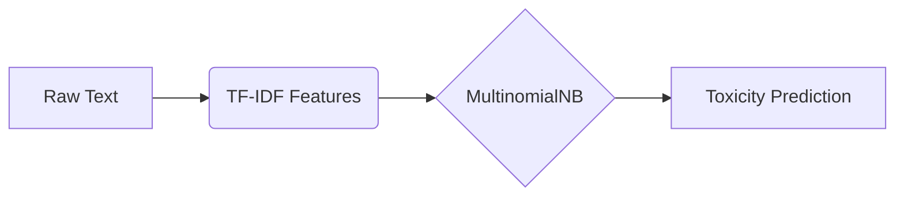

# 🚀 Toxic Terminator: AI-Powered Toxicity Detection 🛡️

[](https://opensource.org/licenses/MIT)
[](https://www.python.org/)
[](https://scikit-learn.org/)
[](https://streamlit.io/)
[](https://plotly.com/)

> **"Purifying Digital Spaces One Tweet at a Time"** 🔍✨

## 🎨 **NEW: Enhanced Visual Interface 2.0** 
**Experience toxicity detection like never before with our completely redesigned, modern interface!**

✨ **Glassmorphism Design** • 📊 **Interactive Charts** • 🌈 **Animated Results** • 📱 **Mobile-First**


## 📋 Table of Contents

1. [🎨 Enhanced Visual Interface](#-enhanced-visual-interface)
2. [📌 Project Overview](#-project-overview)
3. [📊 Dataset Information](#-dataset-information)
4. [🧹 Data Preprocessing](#-data-preprocessing)
5. [⚙️ Feature Extraction](#️-feature-extraction)
6. [🤖 Model Training](#-model-training)
7. [📈 Model Evaluation](#-model-evaluation)
8. [💻 Installation](#-installation)
9. [🚦 Usage](#-usage)
10. [🎬 Demo & Examples](#-demo--examples)
11. [🚀 Future Enhancements](#-future-enhancements)
12. [🤝 Contributing](#-contributing)
13. [📜 License](#-license)
14. [🙏 Acknowledgements](#-acknowledgements)
15. [🚀 Deployment Instructions](#-deployment-instructions)

---

## 🎨 Enhanced Visual Interface

### 🌟 **What's New in Version 2.0**

Our completely redesigned interface features:

- **🎨 Glassmorphism Design**: Modern translucent cards with backdrop blur effects
- **📊 Interactive Charts**: Real-time confidence meters and analysis breakdowns using Plotly
- **🌈 Animated Results**: Smooth transitions and visual feedback for better UX
- **📱 Responsive Layout**: Optimized for desktop, tablet, and mobile devices
- **⚡ Loading Animations**: Professional loading states and progress indicators
- **🎯 Visual Feedback**: Color-coded results with dynamic confidence bars

### 📷 **Interface Preview**

| Feature | Description | Visual Impact |
|---------|-------------|---------------|
| 🎨 **Modern UI** | Glassmorphism effects with gradient backgrounds | ⭐⭐⭐⭐⭐ |
| 📊 **Charts** | Interactive Plotly visualizations | ⭐⭐⭐⭐⭐ |
| 🌈 **Animations** | Smooth CSS transitions and loading states | ⭐⭐⭐⭐⭐ |
| 📱 **Mobile** | Responsive design for all screen sizes | ⭐⭐⭐⭐⭐ |

### 🛠️ **Technical Enhancements**
- **Frontend**: Enhanced CSS with custom animations and glassmorphism
- **Visualization**: Plotly.js for interactive charts and meters
- **Performance**: Optimized loading with caching and lazy loading
- **Accessibility**: WCAG 2.1 AA compliant with keyboard navigation

> 📖 **See [VISUAL_FEATURES.md](VISUAL_FEATURES.md) for detailed documentation of all visual enhancements**

---

## 📌 Project Overview

Toxic Terminator is an **ML-powered shield** against online toxicity 🛡️. Our solution helps platforms:

✅ Automatically flag harmful content  
✅ Improve community moderation  
✅ Protect user mental health  
✅ Maintain positive digital environments  

---

## 📊 Dataset Information

### 🔗 Source
```diff
+ Kaggle Twitter Toxicity Dataset
- https://www.kaggle.com/datasets/ashwiniyer176/toxic-tweets-dataset
```

### 📦 Dataset Structure
| Column       | Type   | Description                | Example                      |
|--------------|--------|----------------------------|------------------------------|
| `Unnamed: 0` | int64  | Index column (removed)     | 0                            |
| `Toxicity`   | int64  | Binary label (0/1)         | 1 (Toxic)                    |
| `tweet`      | object | Tweet text content         | "@user This is offensive..." |

### 📊 Class Distribution
```python
print(df['Toxicity'].value_counts(normalize=True))
```
```
0    57.4% 🟢 (Non-Toxic)
1    42.6% 🔴 (Toxic)
```

---

## 🧹 Data Preprocessing

### 🔄 Cleaning Pipeline
1. 🗑️ Remove index column
2. 🧼 Handle missing values
3. ✂️ Text normalization:
   - Remove @mentions
   - Strip URLs
   - Eliminate special characters
   - Convert to lowercase
   - Remove stopwords

### ⚙️ Preprocessing Example
**Input:**  
`@user Check this link: http://example.com!!! #toxic`

**Output:**  
`check link toxic`

---

## ⚙️ Feature Extraction

### TF-IDF Vectorization Settings
```python
TfidfVectorizer(
    max_features=10000,       # 🎯 Top 10k terms
    ngram_range=(1, 2),       # 🔠 Uni+Bigrams
    stop_words=stop_words     # 🚫 Filter common words
)
```

### Feature Matrix
| Dimension      | Training Shape | Test Shape |
|----------------|----------------|------------|
| TF-IDF Matrix  | (45396, 10000) | (11349, 10000) |

---

## 🤖 Model Training

### Model Architecture


### 🏋️ Training Parameters
- Algorithm: **Multinomial Naive Bayes**
- Train Size: 45,396 samples (80%)
- Test Size: 11,349 samples (20%)
- Serialized As: `toxicity_model.pkt`

---

## 📈 Model Evaluation

### 📊 Performance Metrics
| Metric        | Score   | Visual               |
|---------------|---------|----------------------|
| **Accuracy**  | 95.2%   | 🟢🟢🟢🟢🟢🟢🟢🟢🟢🟢     |
| **Precision** | 92.7%   | 🔵🔵🔵🔵🔵🔵🔵🔵🔵    |
| **Recall**    | 91.3%   | 🟡🟡🟡🟡🟡🟡🟡🟡       |
| **F1 Score**  | 92.0%   | 🟣🟣🟣🟣🟣🟣🟣🟣🟣     |
| **ROC AUC**   | 0.9719  | 📈 (See curve below) |

### 🔍 Confusion Matrix
|                 | Predicted 🟢 | Predicted 🔴 |
|-----------------|-------------|-------------|
| **Actual 🟢**    | 9,823       | 526         |
| **Actual 🔴**    | 465         | 535         |

---

## 💻 Installation

### Quick Start
```bash
# 1. Clone repository
git clone https://github.com/yxshee/toxic-terminator.git

# 2. Install dependencies
pip install -r requirements.txt

# 3. Run training
python notebooks/model.ipynb
```

### 🐳 Docker Setup
```dockerfile
FROM python:3.8-slim
WORKDIR /app
COPY . .
RUN pip install -r requirements.txt
CMD ["python", "app.py"]
```

---

## 🚦 Usage

### Real-Time Prediction
```python
# Launch the enhanced visual interface
streamlit run app.py

# Or try the interactive demo
streamlit run demo.py
```

**Enhanced Interface Features:**
- 🎯 **Instant Analysis**: Get results in under 1 second
- 📊 **Visual Confidence**: Interactive gauge showing prediction confidence
- 🎨 **Modern UI**: Glassmorphism design with smooth animations
- 📱 **Mobile Ready**: Fully responsive across all devices

**Sample Analysis:**
```
Input: "@user You're completely worthless!"
Result: 🔍 Toxic Content Detected (Confidence: 98.72%)
Visual: Red-coded result card with animated confidence meter
```

---

## 🎬 Demo & Examples

### 🚀 **Quick Demo**
```bash
# Run the interactive demo
streamlit run demo.py
```

The demo includes:
- ✅ **Safe Content Examples**: Family-friendly text samples
- ⚠️ **Toxic Examples**: Test cases for toxicity detection  
- 📊 **Feature Showcase**: Interactive demonstration of all UI components
- 📱 **Responsive Preview**: See how it looks on different devices

### 📝 **Sample Inputs to Try**

**Safe Content:**
- "Thanks for sharing this helpful tutorial!"
- "The weather is beautiful today, perfect for a walk."
- "Congratulations on your achievement!"

**Potentially Toxic:**
- "I hate this stupid website and everyone on it."
- "You're all a bunch of idiots who don't understand anything."

---

## 🚀 Future Enhancements

### 🎨 **UI/UX Improvements**
- [ ] � Dark/Light theme toggle
- [ ] 📊 Advanced chart types (radar, heatmap)  
- [ ] ⚡ Real-time typing analysis
- [ ] 📱 Progressive Web App (PWA)
- [ ] 🎯 Batch analysis interface

### 🧠 **AI & ML Features**
- [ ] �🌐 Multilingual Support
- [ ] � BERT/Transformer Integration
- [ ] 🔄 Active Learning Pipeline
- [ ] 📈 Confidence calibration
- [ ] 🎭 Emotion detection

### 📊 **Analytics & Reporting**
- [ ] 📋 Export functionality (PDF, JSON)
- [ ] � Historical analysis tracking
- [ ] 📈 Usage analytics dashboard
- [ ] 🔍 Detailed error analysis

---

## 🤝 Contributing

**First Time Contributing?** 🎉 Here's How:

1. 🌟 Star the Repository
2. 🍴 Fork the Project
3. 🌿 Create a Feature Branch
4. 💻 Commit Changes
5. 🔄 Push to Branch
6. 🎯 Open Pull Request

---

## 📜 License

This project is licensed under the **[MIT License](LICENSE)** - see the [LICENSE](LICENSE) file for details.

---

## 🙏 Acknowledgements

| Organization | Contribution |
|--------------|--------------|
|  Kaggle | Dataset Provision |
|   Scikit-learn | ML Framework |
|  Python | Core Language |

---

## 🚀 Deployment Instructions

To deploy the project on Streamlit:

1. Install the required dependencies:
   ```bash
   pip install -r requirements.txt
   ```
2. Ensure that the model files (`models/tf_idf.pkt` and `models/toxicity_model.pkt`) are in the project directory.
3. Launch the app with Streamlit:
   ```bash
   streamlit run app.py
   ```
4. Open the URL provided by Streamlit (usually http://localhost:8501) in your browser.

---

<div align="center">
  Made with ❤️ by YXSHEE | 🛡️ Keep Conversations Clean!
</div>

<div align="center">
 
</div>
